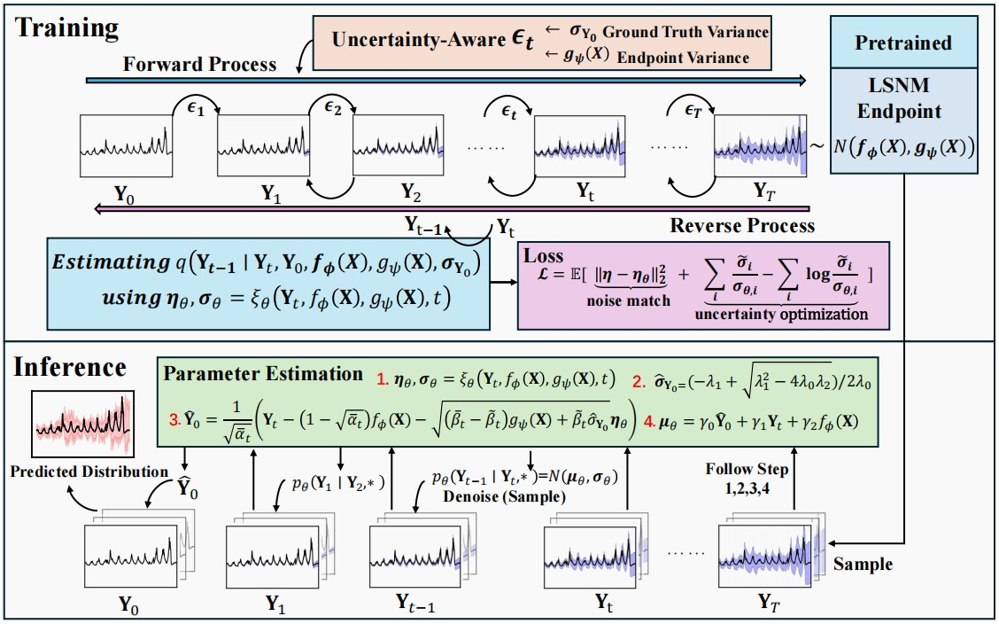

🚀 This is the official repo of "Non-stationary Diffusion For Probabilistic Time Series Forecasting" 

# Contacts

- Weiwei Ye (equal contribution): wwye155@gmail.com
- Zhuopeng Xu (equal contribution): xuzhuopeng@csu.edu.cn
- Ning gui (corresponding author):  ninggui@gmail.com

# News

📌 [2025-05-01] 🎉🎉🎉🎉🎉 NsDiff is accepted as a Spotlight poster  at ICML 2025 — Oral decision pending 🔎

# 1 NsDiff
NsDiff is a new diffusion-based theoretical framework for probalistic forecasting. Specifically designed for non-stationary scenarios.

<p align="center">
  
</p>


# 2 install requirements

```
pip install -r ./requirements.txt
```

# 3 run

⚠️⚠️⚠️⚠️**The dataset will be downloaded automatically.** Just run the following scripts.

see ./scripts/ for more examples.
1. pretrain and run 
```python
#  pretraining
bash ./scripts/pretrain_F/ETTh1.sh
# run 
export PYTHONPATH=./
CUDA_DEVICE_ORDER=PCI_BUS_ID \
python3 ./src/experiments/NsDiff.py \
   --dataset_type="ETTh1" \
   --device="cuda:0" \
   --batch_size=32 \
   --horizon=1 \
   --pred_len=192 \
   --windows=168 \
   --load_pretrain=True \
   runs --seeds='[1232132, 3]'

```


2. run without pretraining

```python
# run without pretraining
export PYTHONPATH=./
CUDA_DEVICE_ORDER=PCI_BUS_ID \
python3 ./src/experiments/NsDiff.py \
   --dataset_type="ETTh1" \
   --device="cuda:0" \
   --batch_size=32 \
   --horizon=1 \
   --pred_len=192 \
   --windows=168 \
   runs --seeds='[1232132, 3]'
```


